# Cortex Proxy 架构文档

## 目录

- [项目概述](#项目概述)
- [整体架构](#整体架构)
- [模块结构](#模块结构)
- [核心流程](#核心流程)
  - [启动流程](#启动流程)
  - [请求拦截与压缩流程](#请求拦截与压缩流程)
  - [响应处理与使用量上报流程](#响应处理与使用量上报流程)
  - [CA 证书安装流程](#ca-证书安装流程)
  - [配置动态刷新流程](#配置动态刷新流程)
- [组件详解](#组件详解)
  - [cmd — 命令入口](#cmd--命令入口)
  - [cert — 证书管理](#cert--证书管理)
  - [platform — 平台客户端](#platform--平台客户端)
  - [proxy — 代理核心](#proxy--代理核心)
  - [reporter — 使用量上报](#reporter--使用量上报)
- [数据结构](#数据结构)
- [降级策略](#降级策略)
- [安全模型](#安全模型)
- [配置参考](#配置参考)
- [依赖关系](#依赖关系)

---

## 项目概述

`cortex-proxy` 是一个 HTTPS 中间人代理（MITM Proxy），运行在用户本地。它通过标准的 `HTTPS_PROXY` 环境变量拦截 AI Agent 发往 LLM 提供商的请求，将消息体发送至 Cortex 平台进行上下文压缩，再将压缩后的请求转发给真实 LLM。

**核心价值：零代码侵入**，用户无需修改 Agent 代码，只需设置环境变量即可接入压缩能力。

```
HTTPS_PROXY=http://localhost:7898
```

---

## 整体架构

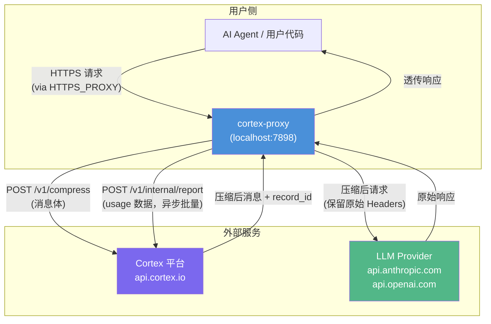

---

## 模块结构

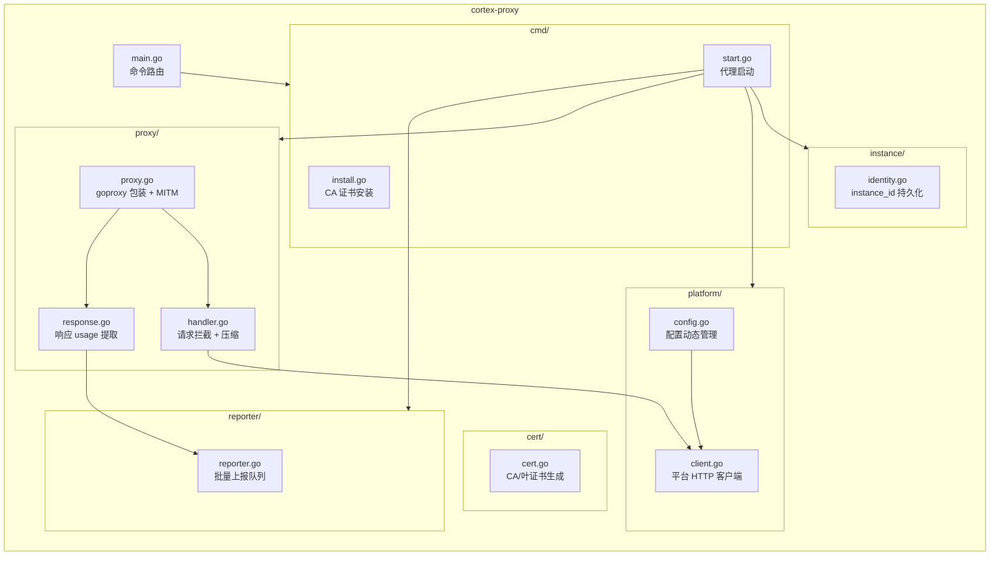

---

## 核心流程

### 启动流程

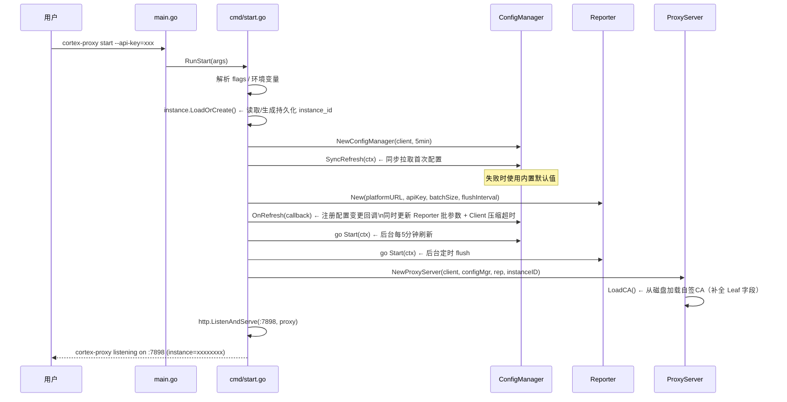

### 请求拦截与压缩流程

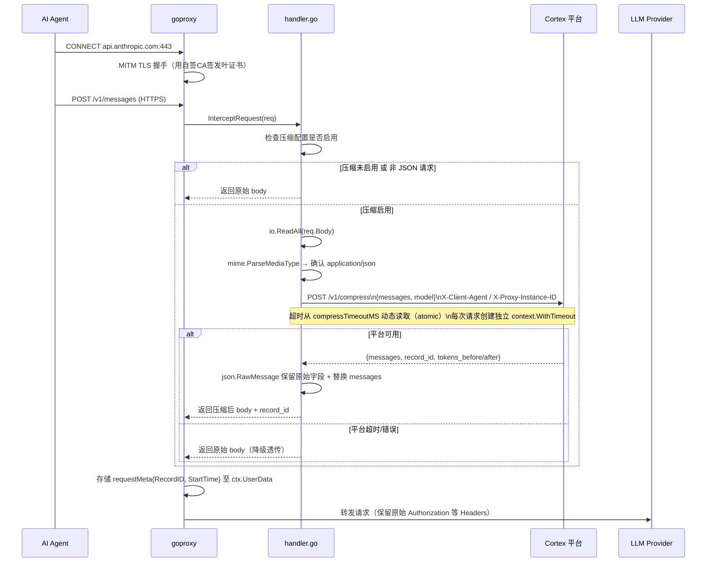

### 响应处理与使用量上报流程

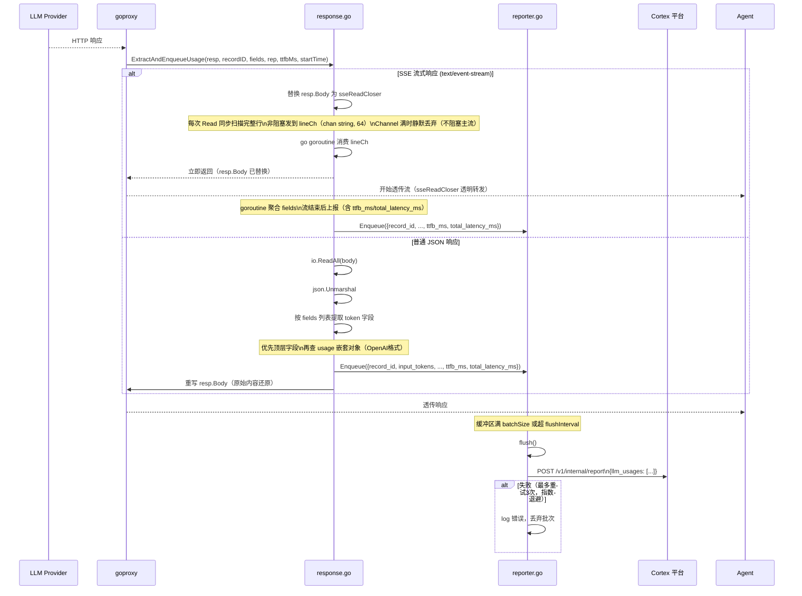

### CA 证书安装流程

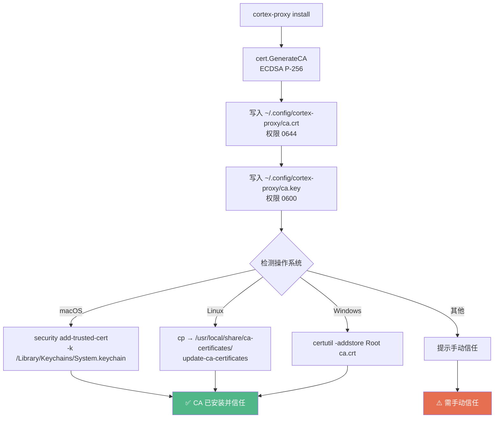

### 配置动态刷新流程

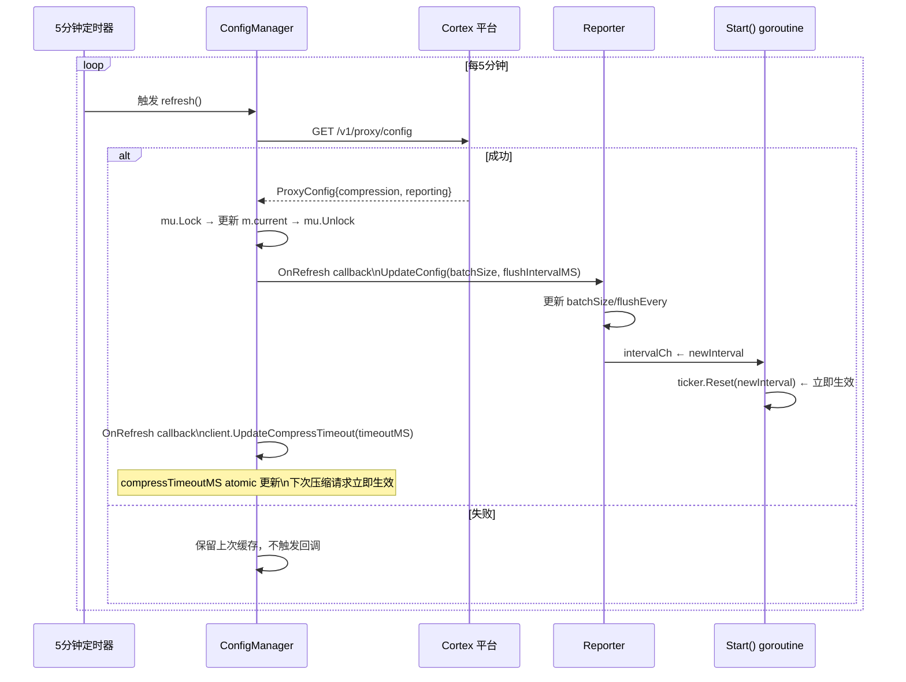

---

## 组件详解

### instance — 实例身份

`instance/identity.go` 提供 `LoadOrCreate()` 函数：

1. 从 `~/.config/cortex/instance-id`（权限 0600）读取已存储的 UUID
2. 若文件不存在或内容非法，生成新 UUID 并写入（目录不存在时自动创建，权限 0700）
3. 若配置目录不可写，回退为随机 UUID（仅当次运行有效）

`instance_id` 通过 `X-Proxy-Instance-ID` 请求头随每次压缩请求发往 Cortex 平台，平台可据此将来自同一机器的多次压缩记录关联在一起。

**存储路径：**
- Linux/macOS：`~/.config/cortex/instance-id`（`$XDG_CONFIG_HOME` 或 `$HOME/.config`）
- Windows：`%APPDATA%\cortex\instance-id`

---

### cmd — 命令入口

| 文件 | 职责 |
|------|------|
| `main.go` | 解析子命令（`install` / `start`），dispatch 到对应函数 |
| `cmd/install.go` | 生成并写入自签 CA 证书，调用 OS 信任命令 |
| `cmd/start.go` | 组装所有依赖（Client / ConfigManager / Reporter / ProxyServer），启动 HTTP 服务 |

**启动参数：**

| 参数 | 环境变量 | 默认值 | 说明 |
|------|---------|--------|------|
| `--api-key` | `CORTEX_API_KEY` | 必填 | Cortex 平台 API Key |
| `--platform` | `CORTEX_PLATFORM_URL` | `https://api.cortex.io` | 平台地址 |
| `--port` | — | `7898` | 代理监听端口 |

---

### cert — 证书管理

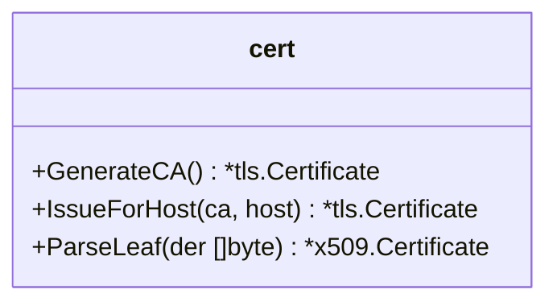

- **`GenerateCA()`**：生成 ECDSA P-256 自签 CA，有效期 10 年，`IsCA=true`
- **`IssueForHost()`**：由 CA 签发指定域名的叶证书，有效期 1 年，用于 MITM TLS
- **`ParseLeaf()`**：解析 DER 编码证书，用于补全 `tls.Certificate.Leaf` 字段，避免 goproxy 运行时重复解析

goproxy 在每次 CONNECT 隧道建立时调用 `IssueForHost` 动态签发证书，对每个目标域名都生成独立证书。`LoadCA` 加载磁盘证书后立即调用 `ParseLeaf` 补全 Leaf，确保 TLS 握手高效。

---

### platform — 平台客户端

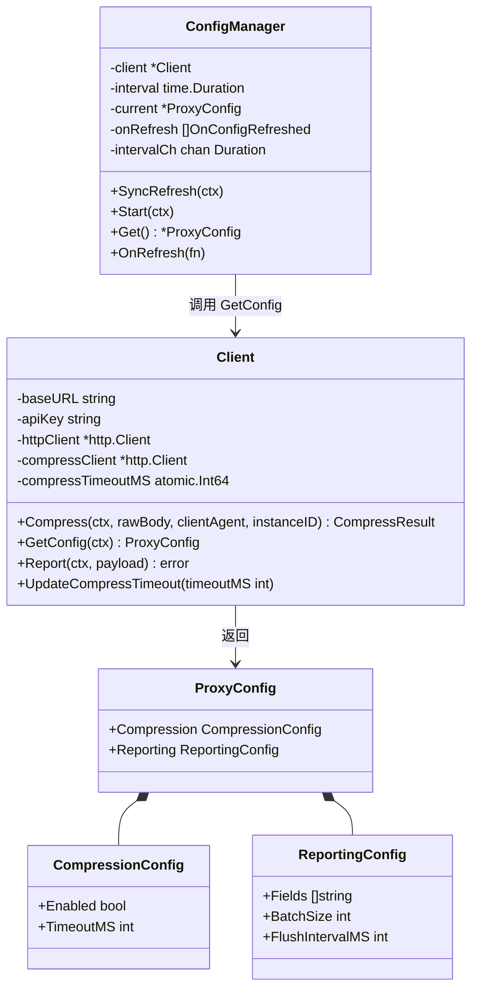

**超时说明：** `Client` 维护两套 HTTP 客户端：
- `httpClient`：固定超时（默认 3000ms），用于 config 拉取和 report 上报
- `compressClient`：无超时（由 `context.WithTimeout` 控制），压缩超时从 `compressTimeoutMS`（`atomic.Int64`）动态读取，可通过 `UpdateCompressTimeout` 实时调整，不需要重建客户端

---

### proxy — 代理核心

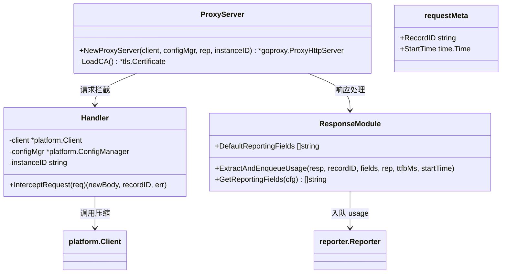

**MITM 工作原理：**

1. 浏览器/Agent 发送 `CONNECT api.anthropic.com:443`
2. goproxy 截获，调用 `cert.IssueForHost("api.anthropic.com")` 签发假证书
3. 返回 `200 Connection Established`，与 Agent 完成 TLS 握手（用假证书）
4. 后续 HTTPS 请求明文可读，可修改 body

**注意：** MITM 配置为实例级（`mitmAction` 局部变量 + `HandleConnectFunc`），不覆盖 `goproxy` 全局变量，支持多实例并发运行。

---

### reporter — 使用量上报

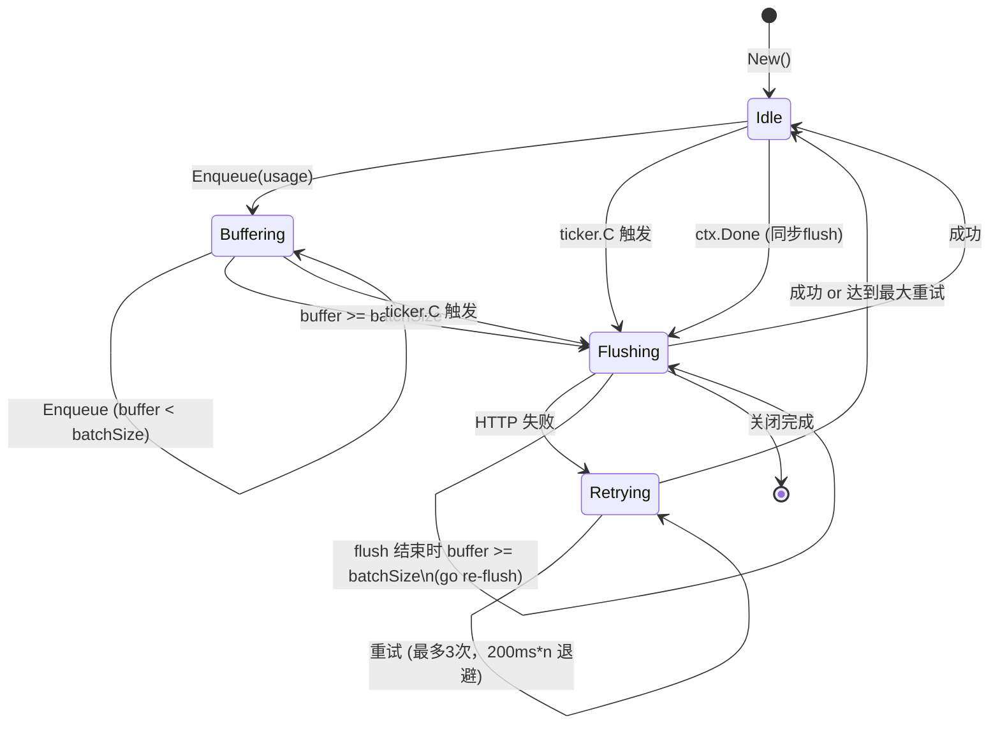

**并发保护：** `flushing bool` 标志防止多个 goroutine 同时触发 flush（`Enqueue` 触发的 `go flush()` 与 ticker 触发的可能并发）。flush 结束后检查缓冲区，若仍达阈值则自动 `go flush()`（re-flush），确保高速写入场景下不积压。

**interval 动态更新：** `UpdateConfig` 通过带缓冲的 `intervalCh chan time.Duration` 通知 `Start()` goroutine 调用 `ticker.Reset()`，无需重启 goroutine。

---

## 数据结构

### CompressResult（来自平台）

```go
type CompressResult struct {
    Messages      []map[string]any // 压缩后的消息列表
    TokensBefore  int              // 压缩前 token 数
    TokensAfter   int              // 压缩后 token 数
    RecordID      string           // 平台记录 ID，用于关联 usage 上报
    HasCCRMarkers bool             // 是否插入了 CCR 召回标记
}
```

### Usage 上报格式

```json
{
  "llm_usages": [
    {
      "record_id": "uuid",
      "input_tokens": 300,
      "output_tokens": 100,
      "cache_read_tokens": 0,
      "cache_write_tokens": 0,
      "stop_reason": "end_turn",
      "ttfb_ms": 120,
      "total_latency_ms": 3500
    }
  ]
}
```

### ProxyConfig（来自平台）

```json
{
  "compression": {
    "enabled": true,
    "timeout_ms": 3000
  },
  "reporting": {
    "fields": ["input_tokens", "output_tokens", "stop_reason"],
    "batch_size": 10,
    "flush_interval_ms": 5000
  }
}
```

---

## 降级策略

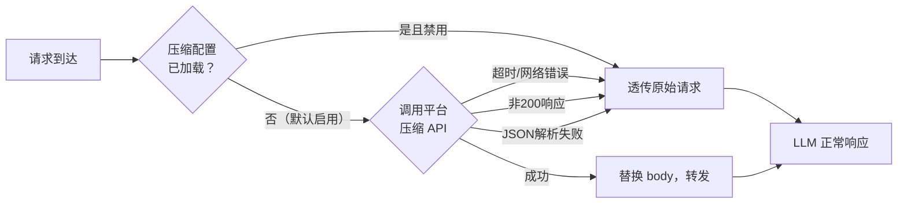

所有降级路径均返回原始 body，确保 Agent 工作流不受影响。

---

## 安全模型

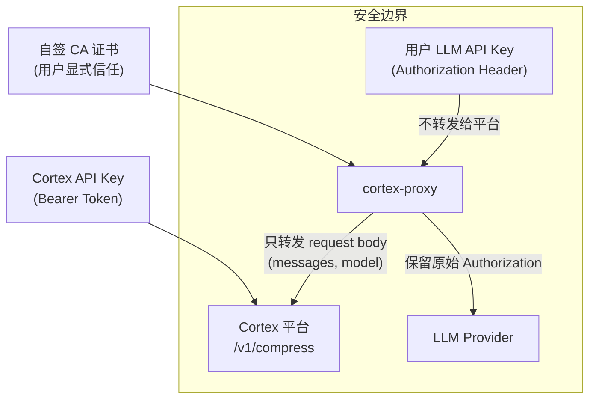

**关键安全属性：**
- 用户的 LLM API Key 只在 proxy 内部中转，**不发送给 Cortex 平台**
- Cortex 平台只接收消息体（messages/model），不接收任何用户凭证
- MITM CA 需要用户主动运行 `cortex-proxy install` 并通过 OS 权限确认

---

## 配置参考

| 参数 | 来源 | 默认值 | 说明 |
|------|------|--------|------|
| `compression.enabled` | 平台配置 | `true` | 是否启用压缩 |
| `compression.timeout_ms` | 平台配置 | `3000` | 调平台压缩的超时（毫秒） |
| `reporting.batch_size` | 平台配置 | `10` | 批量上报条数阈值 |
| `reporting.flush_interval_ms` | 平台配置 | `5000` | 定时 flush 间隔（毫秒） |
| `reporting.fields` | 平台配置 | 见下 | 从响应中提取的字段列表 |

**默认上报字段：**
```
input_tokens, prompt_tokens,
output_tokens, completion_tokens,
cache_read_tokens, cache_write_tokens,
stop_reason
```

---

## 依赖关系

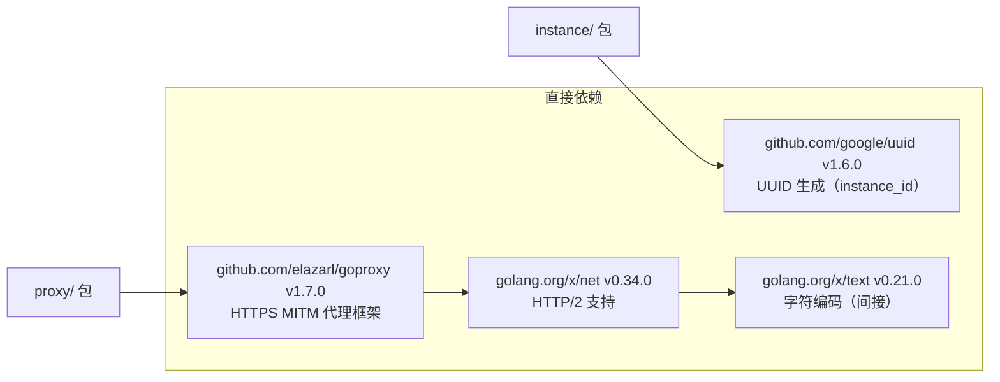

**运行时要求：**
- Go 1.22+
- 已运行 `cortex-proxy install`（CA 证书已安装）
- 有效的 Cortex API Key
- 网络可达 Cortex 平台（降级时不影响 LLM 调用）
